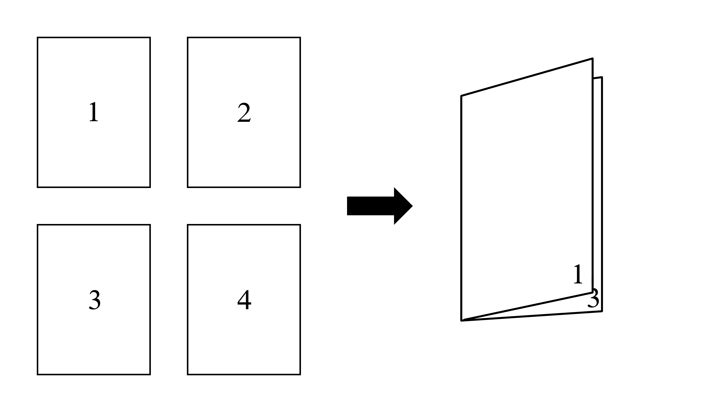

# Book-Binding-Order

  
 

A simple tool for folk bookbindery. Helps with the reordering of page files for printing and binding.

Takes in a folder of numbered page image files, and produces a new folder with those pages re-ordered such that
they can be printed on double-sided leafs and folded to be bound in a booklet. Can also split pages into multiple 
signatures for binding larger books.

Planning to build a simple GUI to make accessible for non-programming oriented types.

